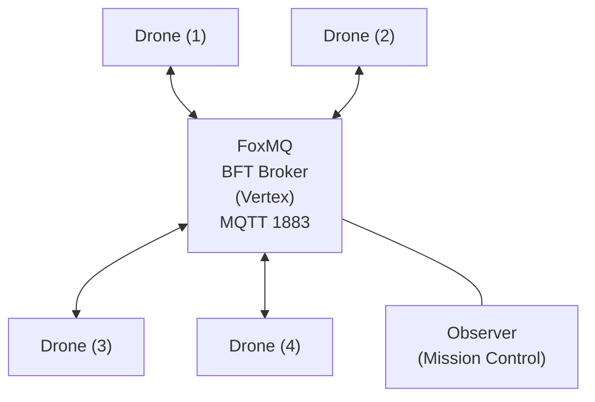

# Terminal Rescue

```text
  _____                   _             _ _____                             
 |_   _|                 (_)           | |  __ \                            
   | | ___ _ __ _ __ ___  _ _ __   __ _| | |__) |___  ___  ___ _   _  ___   
   | |/ _ \ '__| '_ ` _ \| | '_ \ / _` | |  _  // _ \/ __|/ __| | | |/ _ \  
   | |  __/ |  | | | | | | | | | | (_| | | | \ \  __/\__ \ (__| |_| |  __/  
   |_|\___|_|  |_| |_| |_|_|_| |_|\__,_|_|_|  \_\___||___/\___|\__,_|\___|  
```

[](https://youtu.be/59owjPyyP3o)
[](https://github.com/edycutjong/terminalrescue.py/actions/workflows/ci.yml)
[](https://www.python.org/downloads/)
[](https://opensource.org/licenses/MIT)

<video controls autoplay loop muted src="docs/terminal-rescue-demo.webm" poster="docs/terminal-rescue-thumbnail.png" width="100%"></video>

## The Problem

Search-and-rescue operations in disaster zones face a fundamental coordination challenge: when autonomous drone swarms rely on a centralized ROS master node, a single hardware failure brings the entire fleet to its knees. In environments with degraded communications — collapsed cell towers, electromagnetic interference, GPS blackouts — this centralized dependency is not just inconvenient; it's fatal for the people waiting to be found.

## The Solution

**Terminal Rescue** is a hybrid Rust/Python simulation of a leaderless search-and-rescue drone swarm that uses Tashi's FoxMQ decentralized MQTT broker for peer-to-peer coordination. There is no master node. No central database. No single point of failure.

Five independent drone agents — compiled as native **Rust** binaries for maximum throughput — divide a 10×10 disaster grid into search sectors through a consensus-backed bidding protocol. Each drone publishes heartbeats to FoxMQ, which uses Vertex's **BFT (Byzantine Fault Tolerant)** consensus to guarantee that every drone sees messages in the exact same order. This deterministic ordering is the foundation of the entire coordination protocol — it eliminates race conditions in sector claiming and provides mathematically provable coordination correctness.

A **Python FastAPI** server acts as Mission Control, delivering a real-time glassmorphism Web UI dashboard over WebSockets.

## Challenge: DoraHacks Vertex Swarm Challenge (Track 2)

**Terminal Rescue** mathematically proves **Mesh Survival** and **Decentralized Logic** without relying on heavy 3D physics engines. By abstracting the physical environment into a live real-time dashboard, the entire focus of the architecture is on demonstrating FoxMQ's BFT messaging for verifiable, collision-proof drone coordination coupled with a beautiful and accessible Web UI.

### The Kill-Switch Demo

The real proof is in the failure. The core feature is the **Kill-Switch Stunt**:

1. Launch the Uvicorn web server and open the Mission Control web dashboard at `localhost:8000` — it automatically connects to the FoxMQ broker and tracks the autonomous drones.
2. Click the remote **KILL** button next to any drone in the telemetry panel to destroy it mid-mission.
3. The remaining drones detect the missed heartbeat, mark it as `OFFLINE`, release its uncompleted sectors back to the pool, and autonomously re-bid to claim those orphaned sectors.

The grid search completes with **zero orphaned sectors** and **zero human intervention**. This demonstrates **Mesh Survival** — the fleet doesn't just "survive" a node dropout, it actively self-heals and redistributes workload in real time.

### 🚧 Dynamic Hazard Avoidance

The mesh also showcases autonomous trajectory re-routing when presented with sudden geometric obstacles:

1. Click anywhere on the sweeping grid during a live mission to drop an impassable **HAZARD** firewall.
2. The Rust backend instantly broadcasts a massive `+10,000` Euclidean cost penalty to those sectors.
3. The drones instinctively redraw their pathfinding vectors mid-flight, snaking perfectly around the danger zone without losing coordination.

### Why 2D Instead of 3D?

Aligned with the hackathon's "Systems Over Demos" philosophy, we deliberately abstracted 3D aerodynamics into a 2D matrix to invest 100% of engineering time into bulletproof Vertex BFT coordination logic. The 2D grid proves the protocol is **platform-agnostic** — the same coordination algorithm works identically whether running on toy drones, industrial UAVs, or Mars rovers. What matters is the consensus math, not the physics engine.

## Features

- **Leaderless**: No central command. All nodes govern themselves based on shared consensus state.
- **Zero Central Coordinator:** All coordination happens through FoxMQ's consensus-ordered MQTT topics.
- **BFT Consensus Ordering:** FoxMQ/Vertex guarantees all drones process messages in identical order — no race conditions.
- **Deterministic State Replication:** Every drone's local state converges to the same global state via consensus.
- **Heartbeat Failure Detection:** Configurable timeout triggers autonomous workload re-allocation.
- **Aversion-Weighted Pathfinding:** Greedy nearest-neighbor with dynamic `+10,000` cost penalties for real-time hazard avoidance.
- **S-Curve Inertia Physics:** Frontend evaluates Euclidean jumps to compute rendering speeds via `cubic-bezier` mass acceleration with capped velocities.
- **Glassmorphism Web Dashboard:** FastAPI + WebSocket-powered Mission Control with live telemetry, environmental scars (`.crater` from offline nodes), and remote kill capabilities.
- **One-Command Demo:** `make run` launches FoxMQ, FastAPI, and 5 compiled Rust drones. One click for judges.

## 🚀 Quickstart

For hackathon judges, we've designed a friction-free setup using the bundled `Makefile`:

1. **Set up a Python virtual environment** (recommended to avoid polluting global state):
   ```bash
   python3 -m venv venv
   source venv/bin/activate
   ```

2. **One-Command Setup:**
   ```bash
   make setup
   ```
   *(This automatically installs dependencies, sets execution permissions, prepares FoxMQ schema, and sets up FastAPI).*

3. **Launch the Simulation:**
   ```bash
   make run
   ```
   *(Then open `localhost:8000` in your browser)*

## 🛠️ Make Commands Toolkit

```bash
make setup  # Installs deps, modifies permissions, prepares FoxMQ
make run    # (alias `make demo`) Launches background drones and the Uvicorn web server
make kill   # Forcefully terminates any rogue background processes
make clean  # Performs `make kill` and wipes python cache directories
```

## Architecture



## Built With

- **Rust** — Native drone firmware & BFT pathfinding binaries
- **Python 3.11+ / FastAPI** — Mission Control telemetry server
- **FoxMQ v0.3.1** — Tashi's Vertex BFT consensus MQTT broker
- **paho-mqtt (MQTTv5)** — Drone pub/sub messaging
- **Vanilla JS/CSS** — Glassmorphism Web UI (no frameworks)
- **Playwright** — Automated demo recording

## 📸 Demo

### 🎥 Live Video Demo

[**Watch the narrated demo on YouTube**](https://youtu.be/59owjPyyP3o)
