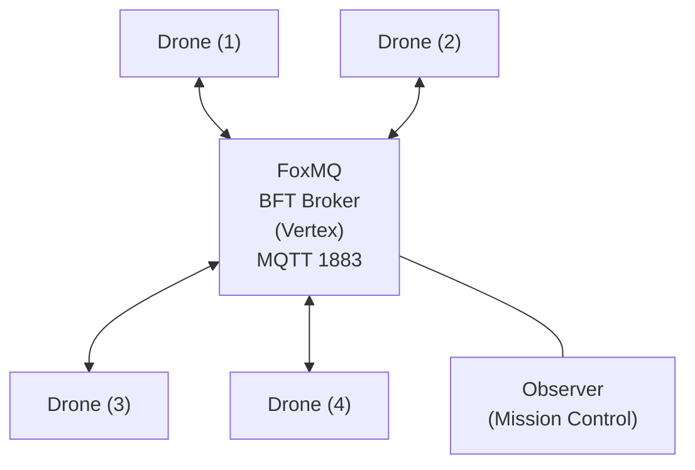
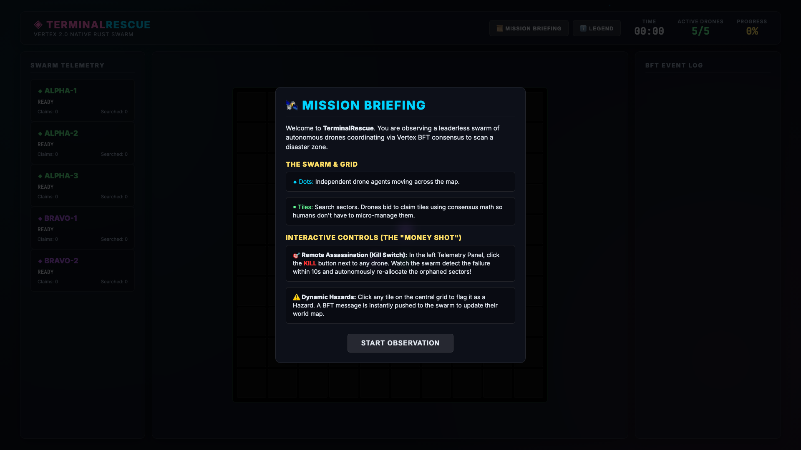
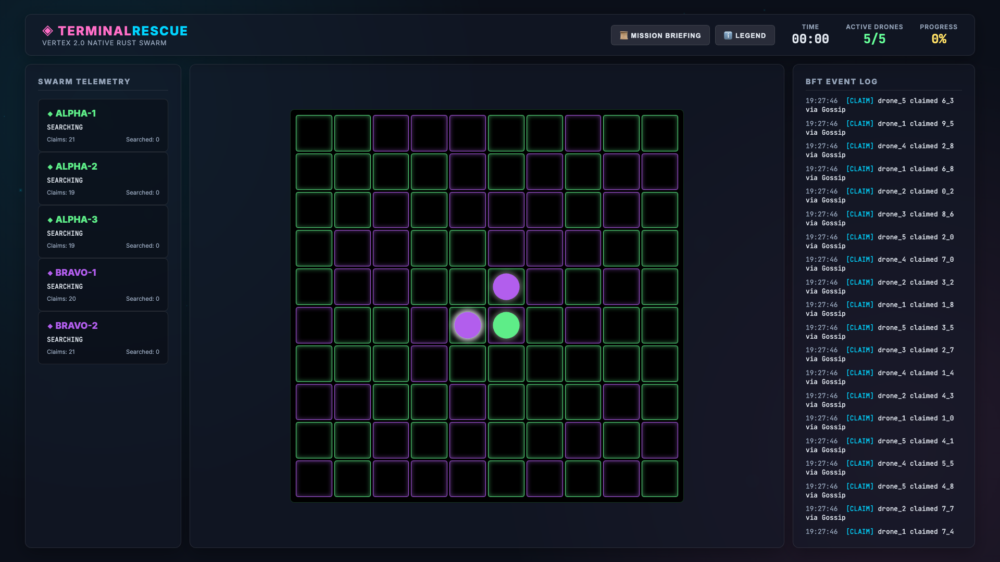
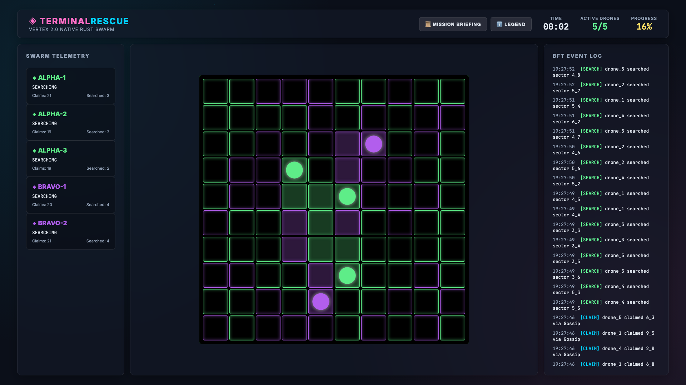
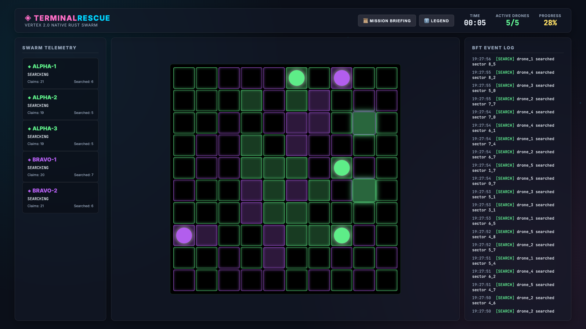
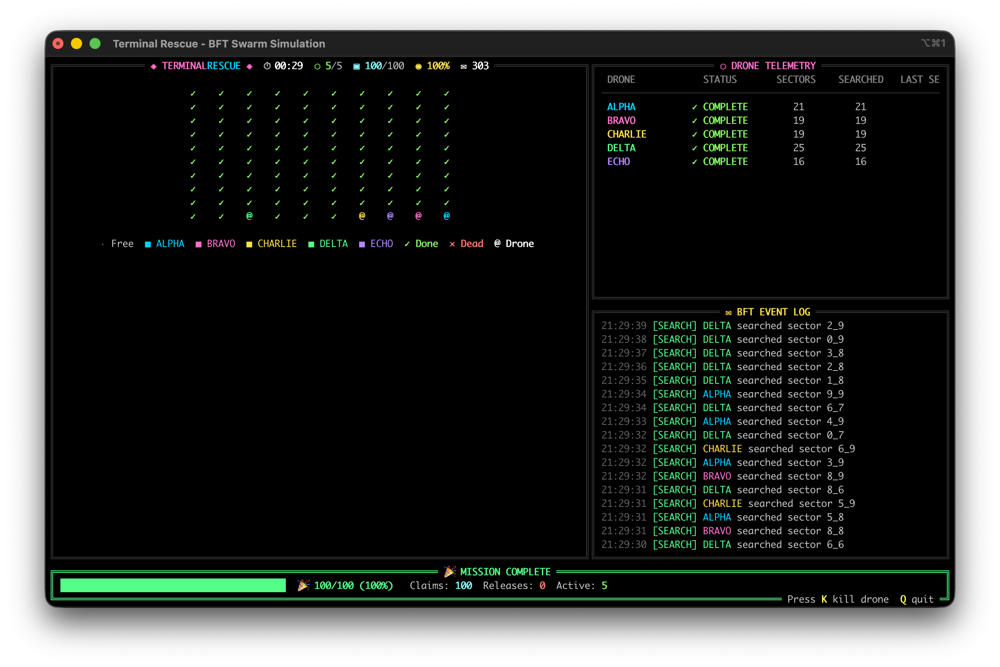
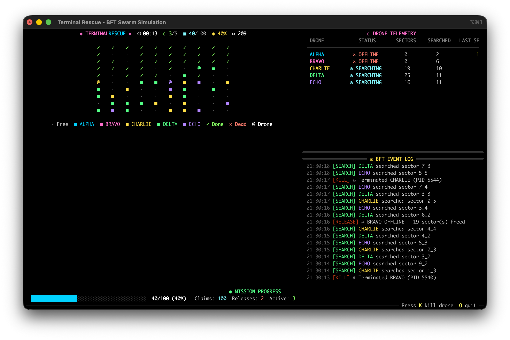
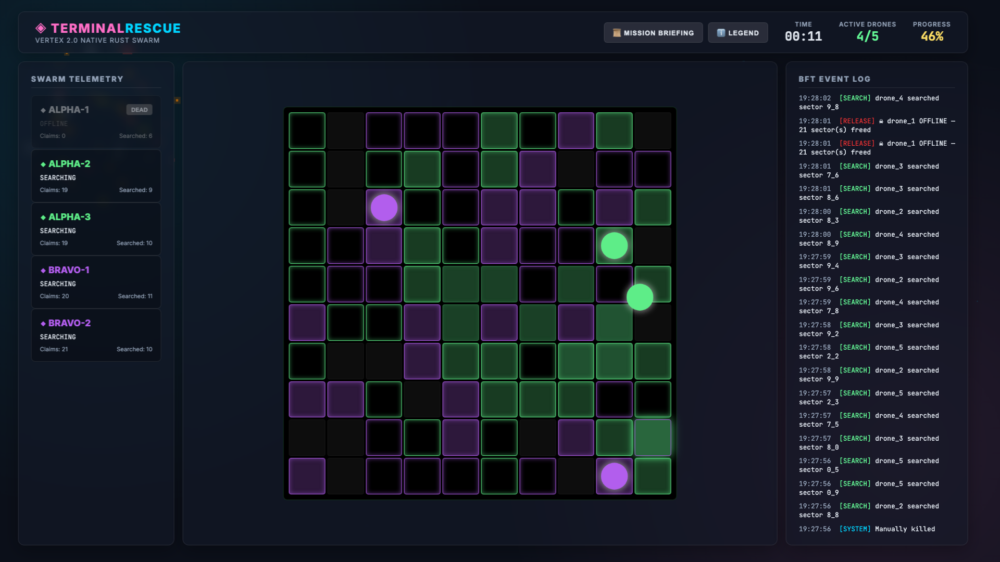
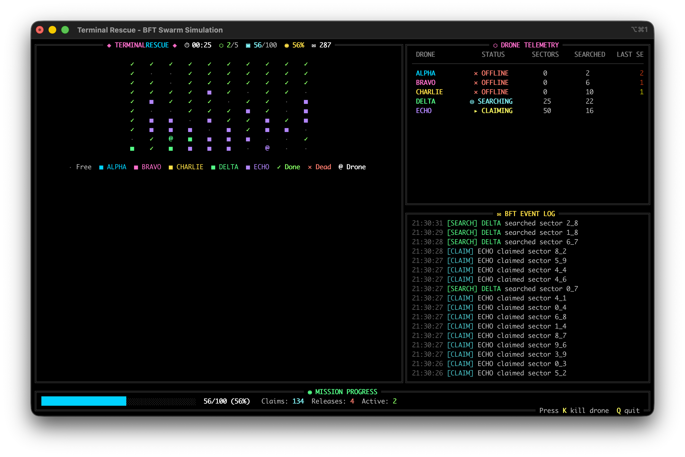

# TerminalRescue.py

```text
  _____                   _             _ _____                                          
 |_   _|                 (_)           | |  __ \                                         
   | | ___ _ __ _ __ ___  _ _ __   __ _| | |__) |___  ___  ___ _   _  ___       _ __  _   _ 
   | |/ _ \ '__| '_ ` _ \| | '_ \ / _` | |  _  // _ \/ __|/ __| | | |/ _ \  _  | '_ \| | | |
   | |  __/ |  | | | | | | | | | | (_| | | | \ \  __/\__ \ (__| |_| |  __/ (_) | |_) | |_| |
   |_|\___|_|  |_| |_| |_|_|_| |_|\__,_|_|_|  \_\___||___/\___|\__,_|\___|     | .__/ \__, |
                                                                               | |     __/ |
                                                                               |_|    |___/ 
```

[](https://youtu.be/SWfuIp6vxs8)
[](https://github.com/edycutjong/terminalrescue.py/actions/workflows/ci.yml)

A pure Python, leaderless search-and-rescue swarm simulation powered by Vertex BFT consensus via Tashi FoxMQ.


## Challenge: DoraHacks Vertex Swarm Challenge (Track 2)

**TerminalRescue** mathematically proves **Mesh Survival** and **Decentralized Logic** without relying on heavy 3D physics engines. By abstracting the environment into a terminal matrix, the entire focus of the architecture is on demonstrating FoxMQ's BFT messaging for verifiable, collision-proof drone coordination.

### The "Money Shot"

The core feature is the **Kill-Switch Stunt**.
1. Launch the fullscreen Mission Control dashboard — it automatically starts the FoxMQ broker and spawns 5 drones.
2. Press **K** to kill a random drone mid-mission.
3. Watch the surviving drones autonomously detect the stale heartbeat, submit a `RELEASE` protocol, and immediately re-bid on the orphaned sectors — all without double-searching.

### Features
- **Leaderless**: No central command. All nodes govern themselves based on shared consensus state.
- **Race-Condition-Proof**: BFT ordering guarantees that if two drones try to `CLAIM` the same sector simultaneously, the network mathematically decides a single winner for all participants.
- **One-Command Demo**: Single `./run_demo.sh` launches broker + observer + 5 drones. Interactive `K` (kill) and `Q` (quit) controls built in.
- **Pure Python + Minimal Deps**: Requires only `paho-mqtt` and `rich`. Easily readable and verifiable by judges within a 5-minute window.

### 🚀 Quickstart

For hackathon judges, we've designed a friction-free setup using the bundled `Makefile`:

1. **Set up a Python virtual environment** (recommended to avoid polluting global state):
   ```bash
   python3 -m venv venv
   source venv/bin/activate
   ```

2. **One-Command Setup:**
   ```bash
   make setup
   ```
   *(This automatically installs dependencies, sets execution permissions, and initializes the FoxMQ BFT broker.)*

3. **Launch the Simulation:**
   ```bash
   make run
   ```

### 🛠️ Make Commands Toolkit
If you get stuck or need to forcefully restart, the `Makefile` includes cleanup tools:

```bash
make setup  # Installs deps, modifies permissions, prepares FoxMQ
make run    # (alias `make demo`) Launches the observer and drones
make kill   # Forcefully terminates any rogue background processes (like leftover brokers)
make clean  # Performs `make kill` and wipes python cache directories
```

### Controls

| Key | Action |
|-----|--------|
| `K` | Kill a random active drone (demonstrates mesh survival) |
| `Q` | Quit the simulation and clean up all processes |

### Architecture



## 📸 Mission Gallery & Demo

### 🎥 Live Video Demo

[](https://youtu.be/SWfuIp6vxs8)

[**Watch on YouTube (`https://youtu.be/SWfuIp6vxs8`)**](https://youtu.be/SWfuIp6vxs8)

### 🕹️ Simulation Timeline

| Swarm Bootup | Grid Claiming |
|:---:|:---:|
|  |  |

| Mesh Stabilization | Mission Control Live |
|:---:|:---:|
|  |  |

| Kill-Switch Activation | Fault Detection (BFT) |
|:---:|:---:|
|  |  |

| Autonomous Recovery | Mission Complete |
|:---:|:---:|
|  |  |
