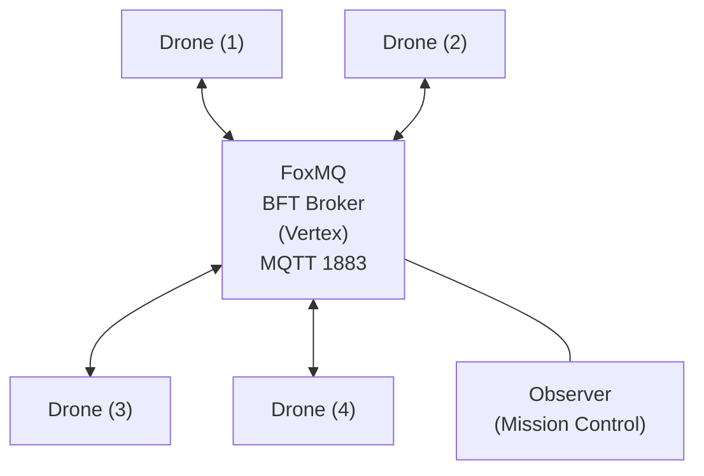

# TerminalRescue.py

```text
  _____                   _             _ _____                                          
 |_   _|                 (_)           | |  __ \                                         
   | | ___ _ __ _ __ ___  _ _ __   __ _| | |__) |___  ___  ___ _   _  ___       _ __  _   _ 
   | |/ _ \ '__| '_ ` _ \| | '_ \ / _` | |  _  // _ \/ __|/ __| | | |/ _ \  _  | '_ \| | | |
   | |  __/ |  | | | | | | | | | | (_| | | | \ \  __/\__ \ (__| |_| |  __/ (_) | |_) | |_| |
   |_|\___|_|  |_| |_| |_|_|_| |_|\__,_|_|_|  \_\___||___/\___|\__,_|\___|     | .__/ \__, |
                                                                               | |     __/ |
                                                                               |_|    |___/ 
```

[](https://youtu.be/SWfuIp6vxs8)
[](https://github.com/edycutjong/terminalrescue.py/actions/workflows/ci.yml)
[](https://www.python.org/downloads/)
[](https://opensource.org/licenses/MIT)

A hybrid Rust/Python, leaderless search-and-rescue swarm simulation powered by Vertex BFT consensus via Tashi FoxMQ. The drone mesh firmware runs on lightning-fast Rust binaries, while the visual Mission Control operates on Python FastAPI.

<video controls autoplay loop muted src="docs/terminal-rescue-demo.webm" width="100%"></video>

## Challenge: DoraHacks Vertex Swarm Challenge (Track 2)

**TerminalRescue** mathematically proves **Mesh Survival** and **Decentralized Logic** without relying on heavy 3D physics engines. By abstracting the physical environment into a live real-time dashboard, the entire focus of the architecture is on demonstrating FoxMQ's BFT messaging for verifiable, collision-proof drone coordination coupled with a beautiful and accessible Web UI.

### The "Money Shot"

The core feature is the **Kill-Switch Stunt**.
1. Launch the Uvicorn web server and open the Mission Control web dashboard at `localhost:8000` — it automatically connects to the FoxMQ broker and tracks the autonomous drones.
2. Click the remote **KILL** action next to any drone in the telemetry panel to kill it mid-mission.
3. Watch the surviving drones autonomously detect the stale heartbeat, submit a `RELEASE` protocol, and immediately re-bid on the orphaned sectors — all without double-searching.

### 🚧 Dynamic Hazard Avoidance

The mesh also showcases autonomous trajectory re-routing when presented with sudden geometric obstacles. 
1. Click anywhere on the sweeping grid during a live mission to drop an impassable **HAZARD** firewall.
2. Observe the Rust backend applying a massive `+10,000` Euclidean cost penalty to those sectors.
3. The drones instinctively redraw their pathfinding vectors mid-flight, snaking around the hazard without losing coordination.

<video controls autoplay loop muted src="docs/hazard-avoidance-demo.webm" width="100%"></video>

### Features
- **Leaderless**: No central command. All nodes govern themselves based on shared consensus state.
- **Race-Condition-Proof**: BFT ordering guarantees that if two drones try to `CLAIM` the same sector simultaneously, the network mathematically decides a single winner for all participants.
- **Aversion Weighting & Greedy Pathfinding**: Drones utilize autonomous nearest-neighbor algorithms over the Rust mesh to organically optimize flight paths. When `HAZARD` zones are dropped, nodes apply extreme cost-weighting penalties (`+10,000` Euclidean distance) to dynamically redraw flight geometry *around* the danger zone.
- **Physical UI Constants**: The frontend evaluates geographical Euclidean jumps to compute rendering speeds, ensuring drones strictly obey S-Curve `cubic-bezier` mass inertia acceleration logic with capped velocities. 
- **Modern Web Interface**: Glassmorphism dashboard built with FastAPI and WebSockets, rendering live telemetry and environmental persistence (e.g. permanent `.crater` scars from offline nodes).
- **One-Command Demo**: Single `make run` executes the FoxMQ broker, FastAPI web server, and spins up the 5 compiled Rust drones. Easily verifiable by judges.

### 🚀 Quickstart

For hackathon judges, we've designed a friction-free setup using the bundled `Makefile`:

1. **Set up a Python virtual environment** (recommended to avoid polluting global state):
   ```bash
   python3 -m venv venv
   source venv/bin/activate
   ```

2. **One-Command Setup:**
   ```bash
   make setup
   ```
   *(This automatically installs dependencies, sets execution permissions, prepares FoxMQ schema, and sets up FastAPI).*

3. **Launch the Simulation:**
   ```bash
   make run
   ```
   *(Then open `localhost:8000` in your browser)*

### 🛠️ Make Commands Toolkit
If you get stuck or need to forcefully restart, the `Makefile` includes cleanup tools:

```bash
make setup  # Installs deps, modifies permissions, prepares FoxMQ
make run    # (alias `make demo`) Launches background drones and the Uvicorn web server
make kill   # Forcefully terminates any rogue background processes
make clean  # Performs `make kill` and wipes python cache directories
```

### Controls (Via Web UI)

Open the Mission Control Web Dashboard at `localhost:8000` to interact with the swarm in real-time. Use the remote kill capabilities linked in the telemetry logs to kill specific drones.

### Architecture



## 📸 Mission Gallery & Demo

### 🎥 Live Video Demo

[**Watch on YouTube (`https://youtu.be/SWfuIp6vxs8`)**](https://youtu.be/SWfuIp6vxs8)

### 🕹️ Simulation Timeline

| Swarm Bootup | Grid Claiming |
|:---:|:---:|
|  |  |

| Mesh Stabilization | Mission Control Live |
|:---:|:---:|
|  |  |

| Kill-Switch Activation | Fault Detection (BFT) |
|:---:|:---:|
|  |  |

| Autonomous Recovery | Mission Complete |
|:---:|:---:|
|  |  |
