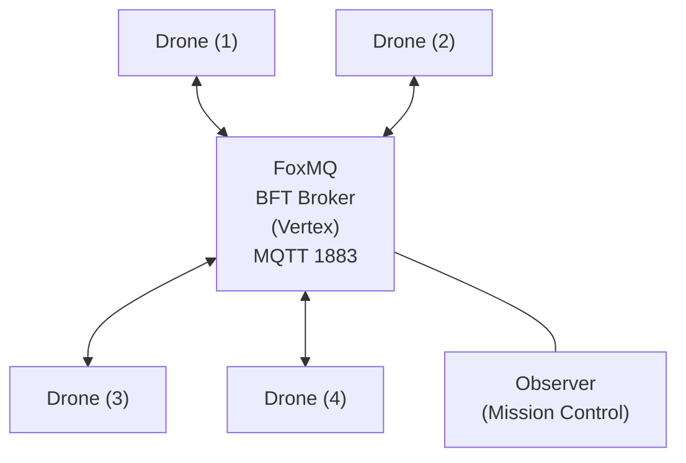

# TerminalRescue.py

A pure Python, leaderless search-and-rescue swarm simulation powered by Vertex BFT consensus via Tashi FoxMQ.

## Challenge: DoraHacks Vertex Swarm Challenge (Track 2)

**TerminalRescue** mathematically proves **Mesh Survival** and **Decentralized Logic** without relying on heavy 3D physics engines. By abstracting the environment into a terminal matrix, the entire focus of the architecture is on demonstrating FoxMQ's BFT messaging for verifiable, collision-proof drone coordination.

### The "Money Shot"

The core feature is the **Kill-Switch Stunt**.
1. Launch the fullscreen Mission Control dashboard — it automatically starts the FoxMQ broker and spawns 5 drones.
2. Press **K** to kill a random drone mid-mission.
3. Watch the surviving drones autonomously detect the stale heartbeat, submit a `RELEASE` protocol, and immediately re-bid on the orphaned sectors — all without double-searching.

### Features
- **Leaderless**: No central command. All nodes govern themselves based on shared consensus state.
- **Race-Condition-Proof**: BFT ordering guarantees that if two drones try to `CLAIM` the same sector simultaneously, the network mathematically decides a single winner for all participants.
- **One-Command Demo**: Single `./run_demo.sh` launches broker + observer + 5 drones. Interactive `K` (kill) and `Q` (quit) controls built in.
- **Pure Python + Minimal Deps**: Requires only `paho-mqtt` and `rich`. Easily readable and verifiable by judges within a 5-minute window.

### Quickstart

1. Set up the Python environment (virtual environment recommended):
   ```bash
   python3 -m venv venv
   source venv/bin/activate
   pip install -r requirements.txt
   ```

2. Initialize FoxMQ (downloads the broker & generates drone configs):
   ```bash
   chmod +x setup_foxmq.sh run_demo.sh
   ./setup_foxmq.sh
   ```

3. Launch the interactive simulation:
   ```bash
   ./run_demo.sh
   ```

### Controls

| Key | Action |
|-----|--------|
| `K` | Kill a random active drone (demonstrates mesh survival) |
| `Q` | Quit the simulation and clean up all processes |

### Architecture


